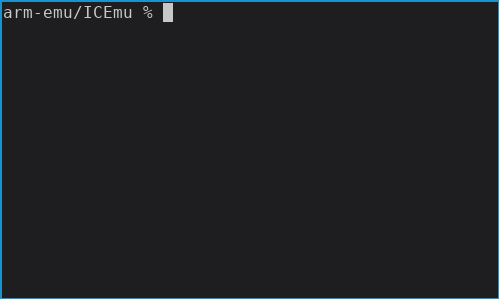

# ICEmu
Intermittent Computing Emulator

## Building ICEmu
1. Checkout ICEmu
2. Update all the sumbmodules: `git submodule update --init --recursive`
3. Create a build directory and build:
`mkdir build && cd build && cmake ../ && make`
4. (optionally) Build arm code in `arm-code`:
`cd arm-code && mkdir build && cd build && cmake ../ && make`
5. Run an elf binary in ICEmu (the memory layout in the config file must
   correspond to that of the device the .elf is created for).

### Demo

